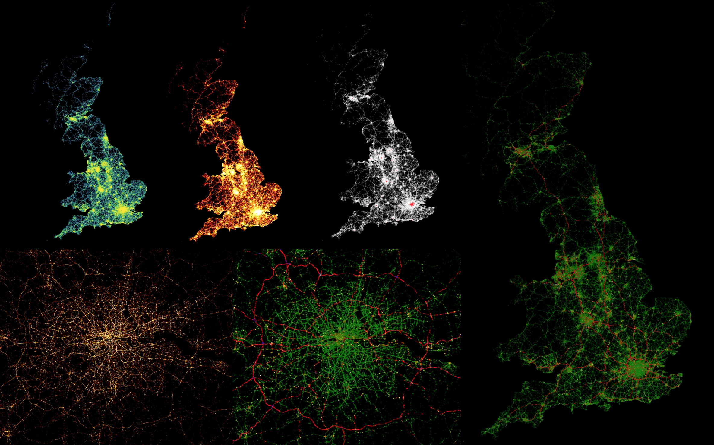

# Visualize Traffic Accidents in UK



This repository contains a series of data science notebooks that performs data science, visualization, and predictive analytics against the [kaggle Dataset: 1.6M accidents & traffic flow over 16 years - Visualise and analyse rich data on traffic demographics](https://www.kaggle.com/daveianhickey/2000-16-traffic-flow-england-scotland-wales/version/10)

All notebooks are stored under the [`notebooks`](./notebooks) directory.

---

Table of Content

- [Setup Instructions](#Setup-Instructions)
- [Notebooks](#Notebooks)

---

<a id="Setup-Instructions"></a>
## Setup Instructions

### Download Data and Setup Input Directory

Download the zip file `1-6m-accidents-traffic-flow-over-16-years.zip` from [the kaggle website](https://www.kaggle.com/daveianhickey/2000-16-traffic-flow-england-scotland-wales/data),
 and extract it to somewhere suitable on your local machine. I assume it goes to your `~/Downloads`

At the root of the repository, create a directory `input` and download (and extract) all the flat files there.

Step 1: Create `input` directory:

```
$ mkdir input
```

Step 2: Move the `1-6m-accidents-traffic-flow-over-16-years.zip` to thie `input` directory

```
$ mv ~/Downloads/1-6m-accidents-traffic-flow-over-16-years.zip ./input
```

Step 3: extract all files within the same `input` directory:

```
$ cd input
$ tar -xvzf 1-6m-accidents-traffic-flow-over-16-years.zip`
```

Once you have the zip file extracted you should see some `.csv` files.

```
Local_Authority_Districts_Dec_2016.geojson
accidents_2005_to_2007.csv
accidents_2009_to_2011.csv
accidents_2012_to_2014.csv
accident_coords_update.ipynb
ukTrafficAADF.csv
```

### Setup conda environment

```
$ conda env create -f environment.yml
```

### Activate conda environment

```
$ source activate
$ source activate ds2
```

### Start Jupyter Notebook

At the repository root directory:

```
$ jupyter notebook
```

Navigate to the `notebooks` directory, and pick the notebook you'd like.

---

<a id="Notebooks"></a>
## Notebooks

All notebooks are stored under the [`notebooks`](./notebooks) directory.

[Visualize-Traffic-Accidents-in-UK-with-Datashader](./Visualize-Traffic-Accidents-in-UK-with-Datashader.ipynb): start with this one. It introduces you the power of big data visualization with Bokeh and Datashader.

[Useful-Resources.ipynb(./Useful-Resources.ipynb): I use this notebook to keep track of useful links. Will be updated from time to time.

