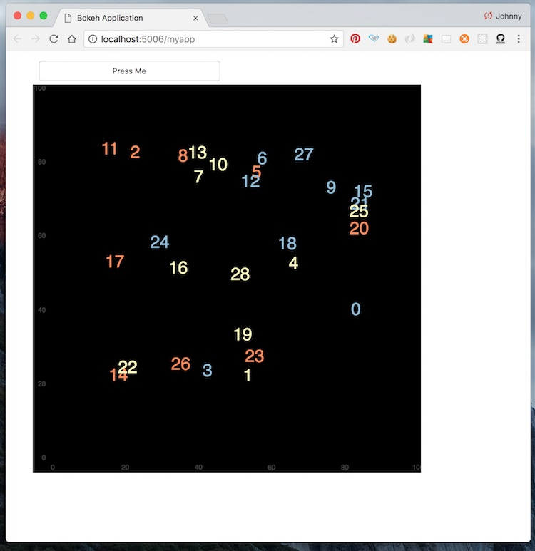

An example web app from [this bokeh doc](https://bokeh.pydata.org/en/latest/docs/user_guide/server.html#single-module-format)

To run the app:

```
bokeh serve --show myapp.py
```

Navigate to [http://localhost:5006/myapp](http://localhost:5006/myapp) to see the web app.



Issue `Cmd` + `C` in terminal to terminate app.